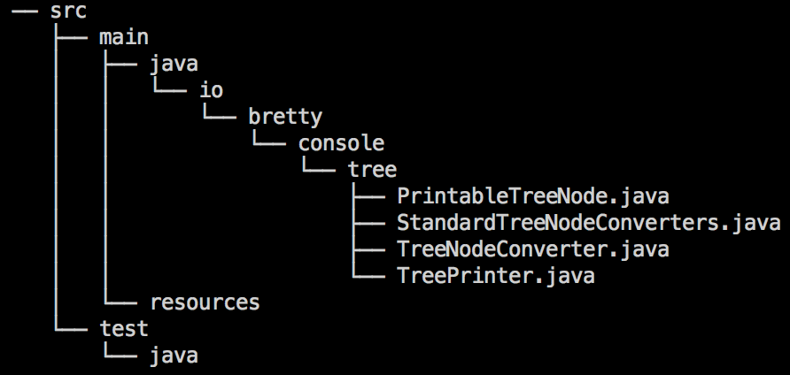

# Console Tree Builder

[](https://search.maven.org/#artifactdetails%7Cio.bretty%7Cconsole-tree-builder%7C2.0%7Cjar)
[]([](https://raw.githubusercontent.com/nathanielove/Java-Console-Tree-Builder/master/license.txt))

The library converts a tree into a formatted string, for exmaple:


or,




## Latest Release

The most recent release is Console Tree Builder 2.0, released 6 March 2016.

Version 2.0 API Docs: [Package io.bretty.console.tree](https://www.javadoc.io/doc/io.bretty/console-tree-builder/2.0)

To add a dependency using Maven, use the following:

```xml
<dependency>
  <groupId>io.bretty</groupId>
  <artifactId>console-tree-builder</artifactId>
  <version>2.0</version>
</dependency>
```

To add a dependency using Gradle:

```groovy
compile 'io.bretty:console-tree-builder:2.0'
```

## Usage Example

There are multiple ways to print your tree in a string:


* Create a `TreeNodeConverter` object for your tree node class that works as an adapter, or
* Make use of one of the default implementations of `TreeNodeConverter` for java classes (e.g. `File` class), or
* Make your own tree node class implement the `PrintableTreeNode` interface

### By Creating `TreeNodeConverter` for Your Own or Third-party Tree Node

Suppose you want to print all the files in a directory `src/`, you will need to use the `File` class provided by Java, but you cannot modify the source code of the default `File` implementation. 

So in this case, just write a converter that allows a `File` object to work as a tree node.

```java
public static void main(String[] args) {

	File root = new File("src/");
	
	TreeNodeConverter<File> converter = new TreeNodeConverter(){
		@Override
		public String name(File file) {
		    return file.getName();
		}

		@Override
		public List<? extends File> children(File file) {
		    List<File> files = new ArrayList<>();
		    if (file.isDirectory()) {
				files.addAll(Arrays.asList(file.listFiles()));
		    }
		    return files;
		}
	};
	
	String output = TreePrinter.toString(root, converter);
	System.out.println(output);
}
```
The output of it will look like the second screenshot above.

### By Using Default `TreeNodeConverter<T>` Implementations

Actually, we have implemented the `TreeNodeConverter<File>` in the `StandardTreeNodeConverters` class. To simplify the example above, simple use the default implementation for `File`:

```java
public static void main(String[] args) {
	File root = new File("src/");
	String output = TreePrinter.toString(root, StandardTreeNodeConverters.FILE);
	System.out.println(output);
}
```

It will print the same result as the second screenshot above.

### By Implementing `PrintableTreeNode` Interface on Your Own Tree Node Class

First, let's assume you already have a class called `TreeNode` in your project:

```java
import java.util.ArrayList;
import java.util.List;
	
public class TreeNode {

	private String name;
	private List<TreeNode> children;

	public TreeNode(String name) {
		this.name = name;
		this.children = new ArrayList<>();
	}

	public void addChild(TreeNode child){
		this.children.add(child);
	}
}
```

Then, implement the `PrintableTreeNode` interface

```java
import io.bretty.console.tree.PrintableTreeNode

public class TreeNode implements PrintableTreeNode{
	...

	public String name() {
		// return the name of the node that you wish to print later
		return this.name;
	}

	public List<TreeNode> children() {
		// return the list of children of this node
		return this.children;
	}
}
```

After that, construct a tree:

```java
import io.bretty.console.tree.TreePrinter

...

	public static void main(String[] args) {

		TreeNode a = new TreeNode("a");
		TreeNode b = new TreeNode("b");
		TreeNode c = new TreeNode("c");
		TreeNode d = new TreeNode("d");
		TreeNode e = new TreeNode("e");
		TreeNode f = new TreeNode("f");
		TreeNode g = new TreeNode("g");
		TreeNode h = new TreeNode("h");
		TreeNode i = new TreeNode("i");
		TreeNode j = new TreeNode("j");
		TreeNode k = new TreeNode("k");
		TreeNode l = new TreeNode("l");

		a.addChild(b);
		a.addChild(c);
		a.addChild(d);
		b.addChild(e);
		b.addChild(f);
		c.addChild(g);
		c.addChild(h);
		d.addChild(i);
		g.addChild(j);
		g.addChild(k);
		k.addChild(l);

		...

```

Finally, convert your tree to string and print it:

```java
		// "a" is the root of the tree constructed above
		String output = TreePrinter.toString(a);
		System.out.println(output);
```

The output of it will look like the first screenshot above.

