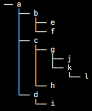

# Console Tree Builder

[](https://search.maven.org/#artifactdetails%7Cio.bretty%7Cconsole-tree-builder%7C1.0%7Cjar)
[]([](https://raw.githubusercontent.com/nathanielove/Java-Console-Tree-Builder/master/license.txt))

The library converts a tree into a formatted string, for exmaple:




## Latest Release

The most recent release is Console Tree Builder 1.0, released 28 Feb 2016.

Version 1.0 API Docs: [Package io.bretty.console.tree](https://www.javadoc.io/doc/io.bretty/console-tree-builder/1.0)

To add a dependency using Maven, use the following:

```xml
<dependency>
  <groupId>io.bretty</groupId>
  <artifactId>console-tree-builder</artifactId>
  <version>1.0</version>
</dependency>
```

To add a dependency using Gradle:

```groovy
compile 'io.bretty:console-tree-builder:1.0'
```

## Classes in the Package

* `PrintableTreeNode` - an interface you your own tree node class must implement
* `TreePrinter` - a utility class that takes a root tree node and convert the entire tree into a formatted string


## Usage Example

First, let's assume you already have a class called `TreeNode` in your project:

```java
import java.util.ArrayList;
import java.util.List;
	
public class TreeNode {

	private String name;
	private List<TreeNode> children;

	public TreeNode(String name) {
		this.name = name;
		this.children = new ArrayList<>();
	}

	public void addChild(TreeNode child){
		this.children.add(child);
	}
}
```

Then, implement the `PrintableTreeNode` interface

```java
import io.bretty.console.tree.PrintableTreeNode

public class TreeNode implements PrintableTreeNode{
	...

	public String name() {
		// return the name of the node that you wish to print later
		return this.name;
	}

	public List<TreeNode> children() {
		// return the list of children of this node
		return this.children;
	}
}
```

After that, construct a tree:

```java
import io.bretty.console.tree.TreePrinter

...

	public static void main(String[] args) {

		TreeNode a = new TreeNode("a");
		TreeNode b = new TreeNode("b");
		TreeNode c = new TreeNode("c");
		TreeNode d = new TreeNode("d");
		TreeNode e = new TreeNode("e");
		TreeNode f = new TreeNode("f");
		TreeNode g = new TreeNode("g");
		TreeNode h = new TreeNode("h");
		TreeNode i = new TreeNode("i");
		TreeNode j = new TreeNode("j");
		TreeNode k = new TreeNode("k");
		TreeNode l = new TreeNode("l");

		a.addChild(b);
		a.addChild(c);
		a.addChild(d);
		b.addChild(e);
		b.addChild(f);
		c.addChild(g);
		c.addChild(h);
		d.addChild(i);
		g.addChild(j);
		g.addChild(k);
		k.addChild(l);

		...

```

Finally, convert your tree to string and print it:

```java
		// "a" is the root of the tree constructed above
		String output = TreePrinter.toString(a);
		System.out.println(output);
```
